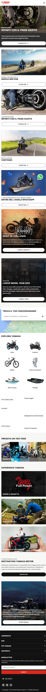
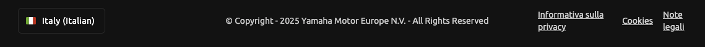

# Landing page Yamaha

Sviluppa una landing page per Yamaha utilizzando HTML, CSS. La pagina deve essere responsive.
Puoi utilizzare Tailwind, Bootstrap o Daisyui per lo stile, l'importante è che la pagina sia fedele all'originale ([vedi link](https://www.yamaha-motor.eu/it/it/home/)).
Troverai alcune immagini nella cartella `public` che puoi utilizzare.
Per le icone puoi utilizzare [Fontawesome](https://fontawesome.com/search?o=r) o [Heroicons](https://heroicons.com/) o similari.

Esempio:

```html

```

## Istruzioni per l'installazione

1. Installa le dipendenze:

   ```bash
   npm install
   ```

2. Avvia il server di sviluppo:

   ```bash
   npm run dev
   ```

Se scegli di utilizzare tailwind, assicurati di decommentare la linea `@import "tailwindcss` nel file `src/style.css`.

## Mockup di riferimento

### Desktop


### Mobile



## Transizioni

Presta attenzione alle transizioni, devono essere fluide e piacevoli.

### Pulsanti

Tutti i pulsanti hanno questo effetto al passaggio del mouse:

<video controls src="docs/Screen Recording 2025-09-28 at 22.42.26.mov" title="Title"></video>

### Pulsanti a comparsa

<video controls src="docs/Screen Recording 2025-09-28 at 22.44.31.mov" title="Title"></video>

## Note finali

- Assicurati che i link siano sottolineati al passaggio del mouse.
- La pagina deve essere completamente responsive e adattarsi completamente a diverse dimensioni di schermo.
- Ignora la parte in basso del footer:
  
